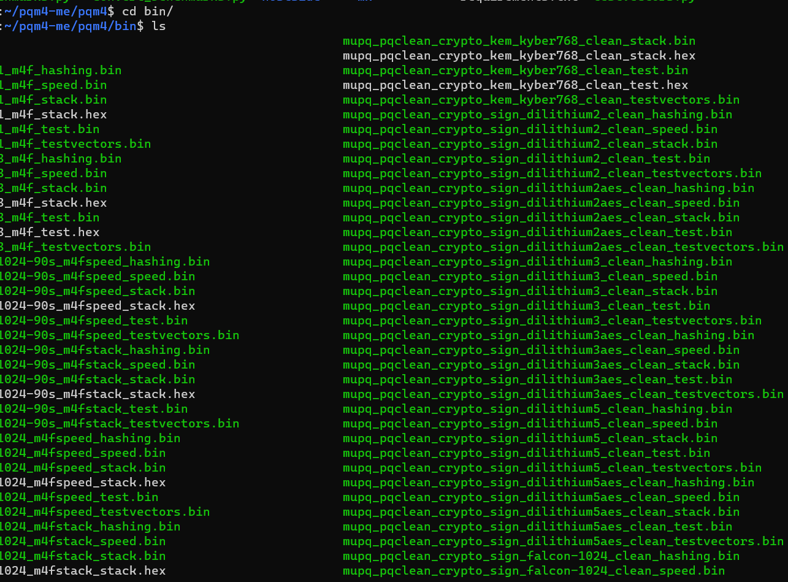
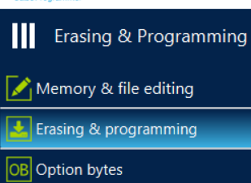
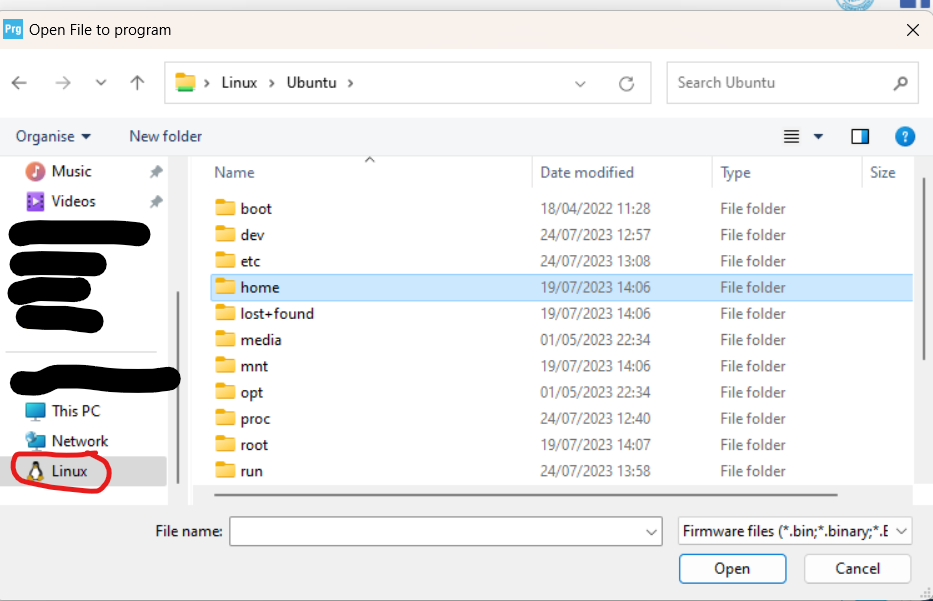
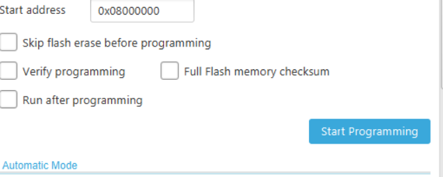
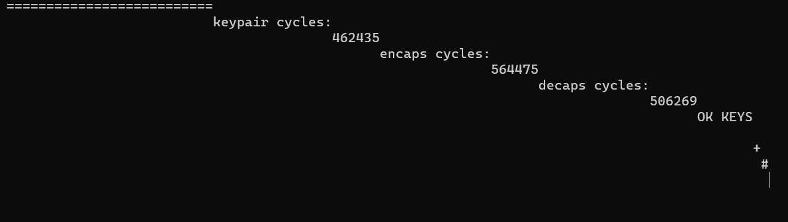
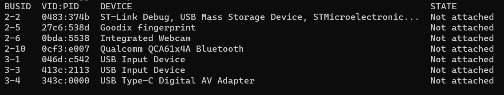
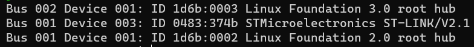
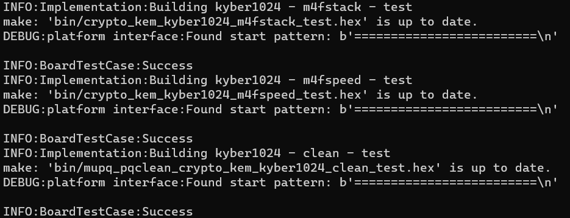

# PQM4

This repository has been forked from [pqm4](https://github.com/mupq/pqm4), however the original project has been created on linux and only provides instructions to compile on linux. This fork provided instructions on how to compile on windows.

# Contents
- [PQM4](#pqm4)
- [Contents](#contents)
  - [Requirements](#requirements)
  - [Prerequisites](#prerequisites)
    - [Setup the Windows Subsystem for Linux](#setup-the-windows-subsystem-for-linux)
    - [Install the required linux packages](#install-the-required-linux-packages)
  - [Compiling](#compiling)
    - [Windows File-system](#windows-file-system)
    - [Clone and compile the project](#clone-and-compile-the-project)
  - [Flashing](#flashing)
    - [Using Windows](#using-windows)
    - [Running Tests](#running-tests)


## Requirements

- Administrator privileges
- Knowledge of how to use the command line
- Knowledge of how to use [git](https://en.wikipedia.org/wiki/Git)

## Prerequisites

Before we can start to compile the code, we need to install some additional tools.

### Setup the Windows Subsystem for Linux

In order to compile this project correctly on windows you will need to use the [Windows Subsystem for Linux](https://en.wikipedia.org/wiki/Windows_Subsystem_for_Linux) (WSL). This emulates a linux kernel on windows and allows us to use linux tools on windows.

Installing WSL is very simple now and can done from the microsoft store.

To learn how to install WSL please refer to this [guide](https://ubuntu.com/tutorials/install-ubuntu-on-wsl2-on-windows-11-with-gui-support#1-overview). This demonstrates how to install ubuntu on WSL, however you can install any linux distribution you want, but be aware that this tutorial uses ubuntu. You are only required to follow the first 4 steps of the guide as we will not be using the GUI.

If you are unfamilar with linux [here](https://www.hostinger.co.uk/tutorials/linux-commands) is a quick guide to understand some basic commands.

### Install the required linux packages

Once WSL has been installed and setup we need to install a few packages that are required to compile the code. These are as follows:

- [Make](https://en.wikipedia.org/wiki/Make_(software)) - `sudo apt install make`
- python-is-python3 - `sudo apt install python-is-python3`
- [Arm GCC Toolchain](https://developer.arm.com/Tools%20and%20Software/GNU%20Toolchain) - `sudo apt install gcc-arm-none-eabi`
- [openocd](https://openocd.org/) - `sudo apt install openocd`

## Compiling

### Windows File-system

To compile this project using WSL you can either use the linux file system or the windows. To access the windows file system run `cd /mnt/c` to access your `C` drive. You can then navigate to the desired folder. However accessing the windows file-system from WSL is very slow.

### Clone and compile the project

To clone this project from [GitHub](https://github.com/) in WSL simply run:

```bash
git clone --recursive https://github.com/QUB-ARM-STM32/pqm4.git
```

We can then access this cloned repository by:

```bash
cd ./pqm4
```

To compile it is very simple, we can run:

```bash
make -j8 PLATFORM=nucleo-l4r5zi
```

Where `-j` is the number of jobs to run at once.

This command may take some time to complete especially of you are operating over the windows file-system.

Once the command finishes executing you should see the results in the `/bin` and `/elf` folders.



## Flashing

### Using Windows

The easiest method to flash a single binary is to use [STM32CubeProgrammer](https://www.st.com/en/development-tools/stm32cubeprog.html).

1. Download the [STM32CubeProgrammer](https://www.st.com/en/development-tools/stm32cubeprog.html)
2. Open the STM32CubeProgrammer and navigate to the `Erasing & Programming` section.

    

3. Press browse and locate the binary (.bin) file you wish to use. If you are using the linux file system you will be able to locate the compiled files from the `Linux` tab of your file explorer. Then going to `home` -> `(your username)`.

    

4. When you select a binary file enure the settings are the same as below:

    

5. Press `Start Programming` to flash the program onto the board. Ensure that you connect to the board before attempting to flash it.
6. Open a serial monitor ans set the baud rate to `38400` to see the output.

    

    The output may like strange that is becuase it is designed to be used with the testing framework included.

### Running Tests

To be able to run the tests we will need to pass our usb devices from windows. This is not native functionality of WSL and requires some additional setup.

1. [This guide](https://learn.microsoft.com/en-us/windows/wsl/connect-usb) describes the steps necessary to pass usb devices from windows to WSL.
2. Once you have installed the necessary drivers and setup the usbip service you, connect your STM32 board to your computer. Open a powershell window and run:
  
    ```powershell
    usbipd wsl list
    ```

    

2. Take note of the `BUSID` of the `ST-Link` device connected. To attach the device to WSL run:

    ```powershell
    usbipd wsl attach --busid 2-2
    ```

    This will attach to the default distribution, if you are using a different distribution you can specify it by using the `--distribution` flag.

    **N.B If you receive a message such as `usbipd: error: Access denied; this operation requires administrator privileges.` simply open powershell as an administrator and run `usbipd bind --busid {id} and rerun the above command`**

3. To check that the device has been attached correctly, open our linux terminal and run:

    ```bash
    lsusb
    ```

    If the device has been attached correctly you should see the device listed.

    

4. To run the tests we need to navigate to the `pqm4` directory and run:

    ```bash
    python3 test.py -p nucleo-l4r5zi -u /dev/ttyACM0 kyber1024
    ```

    Where `-p` is the platform, `-u` is the serial port and `kyber1024` is the algorithm to test.

    

    For more advanced testing options refer to the [pqm4 options](./pqm4.md#running-tests-and-benchmarks).
