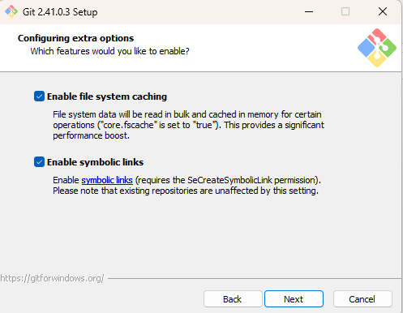

# PQM4

This repository has been forked from [pqm4](https://github.com/mupq/pqm4), however the original project has been created on linux and only provides instructions to compile on linux. This fork provided instructions on how to compile on windows.

## Requirements

- Administrator privileges
- Knowledge of how to use the command line
- Knowledge of how to use [git](https://en.wikipedia.org/wiki/Git)

## Prerequisites

Before we can start to compile the code, we need to install some additional tools.

### Install Git For Windows

We first need to install [git for windows](https://gitforwindows.org/). This will allow us to download the source code from github.

When installing git ensure that you select to `Enable Symbolic Links` as the original authors included linux symbolic links in their github project and windows cannot properly handle these links without this option.

### Setup the Windows Subsystem for Linux

In order to compile this project correctly on windows you will need to use the [Windows Subsystem for Linux](https://en.wikipedia.org/wiki/Windows_Subsystem_for_Linux) (WSL). This emulates a linux kernel on windows and allows us to use linux tools on windows.

Installing WSL is very simple now and can done from the microsoft store.

To learn how to install WSL please refer to this [guide](https://ubuntu.com/tutorials/install-ubuntu-on-wsl2-on-windows-11-with-gui-support#1-overview). This demonstrates how to install ubuntu on WSL, however you can install any linux distribution you want, but be aware that this tutorial uses ubuntu. You are only required to follow the first 4 steps of the guide as we will not be using the GUI.

### Install the required linux packages

Once WSL has been installed and setup we need to install a few packages that are required to compile the code. These are as follows:

- [Make](https://en.wikipedia.org/wiki/Make_(software)) - `sudo apt install make`
- python-is-python3 - `sudo apt install python-is-python3`
- [Arm GCC Toolchain](https://developer.arm.com/Tools%20and%20Software/GNU%20Toolchain) - `sudo apt install gcc-arm-none-eabi`

### Enable Developer Mode

To properly clone the repository we need to enable developer mode on windows. This is needed so that we can create the correct symbolic links when we clone the repository.

- For Windows 10 goto `Settings` -> `Update & Security` -> `For Developers` and select `Developer Mode`
- For Windows 11 goto `Settings` -> `Privacy & Security` -> `For Developers` and select `Developer Mode`

TEST

