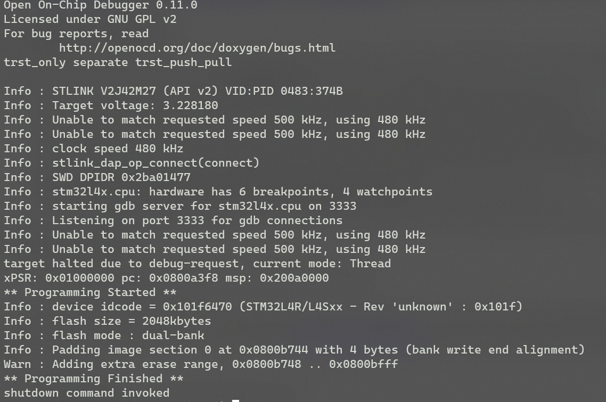
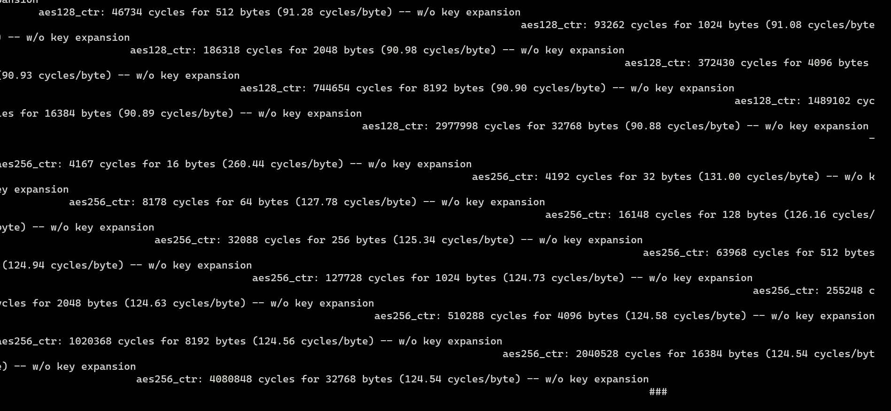

# PQM4

This repository has been forked from [pqm4](https://github.com/mupq/pqm4), however the original project has been created on linux and only provides instructions to compile on linux. This fork provided instructions on how to compile on windows.

# Contents
- [PQM4](#pqm4)
- [Contents](#contents)
  - [Requirements](#requirements)
  - [Prerequisites](#prerequisites)
    - [Setup the Windows Subsystem for Linux](#setup-the-windows-subsystem-for-linux)
    - [Install the required linux packages](#install-the-required-linux-packages)
  - [Compiling](#compiling)
    - [Windows File-system](#windows-file-system)
    - [Clone and compile the project](#clone-and-compile-the-project)
  - [Flashing](#flashing)
    - [Using Linux](#using-linux)
    - [Using Windows](#using-windows)
    - [Running Tests](#running-tests)
  - [Running Benchmarks](#running-benchmarks)
    - [Results](#results)
  - [Using pqm4 schemes in an STM32Cube project](#using-pqm4-schemes-in-an-stm32cube-project)


## Requirements

- Administrator privileges
- Knowledge of how to use the command line
- Knowledge of how to use [git](https://en.wikipedia.org/wiki/Git)

## Prerequisites

Before we can start to compile the code, we need to install some additional tools. This guide is for those using windows 10 and 11.

### Setup the Windows Subsystem for Linux

In order to compile this project correctly on windows you will need to use the [Windows Subsystem for Linux](https://en.wikipedia.org/wiki/Windows_Subsystem_for_Linux) (WSL). This emulates a linux kernel on windows and allows us to use linux tools on windows.

Installing WSL is very simple now and can done from the microsoft store.

To learn how to install WSL please refer to this [guide](https://ubuntu.com/tutorials/install-ubuntu-on-wsl2-on-windows-11-with-gui-support#1-overview). This demonstrates how to install ubuntu on WSL, however you can install any linux distribution you want, but be aware that this tutorial uses ubuntu. You are only required to follow the first 4 steps of the guide as we will not be using the GUI.

If you are unfamiliar with linux [here](https://www.hostinger.co.uk/tutorials/linux-commands) is a quick guide to understand some basic commands.

### Install the required linux packages

Once WSL has been installed and setup we need to install a few packages that are required to compile the code. These are as follows:

- [Make](https://en.wikipedia.org/wiki/Make_(software)) - `sudo apt install make`
- python-is-python3 - `sudo apt install python-is-python3`
- [Arm GCC Toolchain](https://developer.arm.com/Tools%20and%20Software/GNU%20Toolchain) - `sudo apt install gcc-arm-none-eabi`
- [openocd](https://openocd.org/) - `sudo apt install openocd`

## Compiling

### Windows File-system

To compile this project using WSL you can either use the linux file system or the windows. To access the windows file system run `cd /mnt/c` to access your `C` drive. You can then navigate to the desired folder. However accessing the windows file-system from WSL is very slow.

### Clone and compile the project

To clone this project from [GitHub](https://github.com/mupq/pqm4) in WSL simply run:

```bash
git clone --recursive https://github.com/mupq/pqm4.git
```

**N.B This guide has been created using commit a525417134995302bb5013dd112dec65cdb28ca9**

If you want to clone this repository with extra tools for displaying the data from the benchmarks then run the following command. However this may become outdated in the future.

```bash
git clone --recursive https://github.com/QUB-ARM-STM32/pqm4.git
```

We can then access this cloned repository by:

```bash
cd ./pqm4
```

To compile it is very simple, we can run:

```bash
make -j8 PLATFORM=nucleo-l4r5zi
```

Where `-j` is the number of jobs to run at once.

This command may take some time to complete especially of you are operating over the windows file-system.

Once the command finishes executing you should see the results in the `bin/` and `elf/` folders.


## Flashing

### Using Linux

If you wish to flash a single binary using WSL you must install some additional tools.

1. [This guide](https://learn.microsoft.com/en-us/windows/wsl/connect-usb) describes the steps necessary to pass usb devices from windows to WSL.

    **UPDATE 27/07/23 - If you have followed the above tutorial but receive an error when trying to attach the USB device you will need to run the following from your linux terminal**

    ```bash
    sudo apt install linux-tools-virtual hwdata
    sudo update-alternatives --install /usr/local/bin/usbip usbip `ls /usr/lib/linux-tools/*/usbip | tail -n1` 20
    ```

2. Once you have installed the necessary drivers and setup the usbip service, connect your STM32 board to your computer. Open a powershell window and run:
  
    ```powershell
    usbipd wsl list
    ```

    

3. Take note of the `BUSID` of the `ST-Link` device connected. To attach the device to WSL run:

    ```powershell
    usbipd wsl attach --busid 2-2
    ```

    This will attach to the default distribution, if you are using a different distribution you can specify it by using the `--distribution` flag.

    **N.B If you receive a message such as `usbipd: error: Access denied; this operation requires administrator privileges.` simply open powershell as an administrator and run `usbipd bind --busid {id}` and rerun the above command from a normal powershell window.**

4. To check that the device has been attached correctly, open your linux terminal and run:

    ```bash
    lsusb
    ```

    If the device has been attached correctly you should see the device listed.

    

5. To find out which `tty` port your board has been bound to simply run:

    ```bash
    dmesg | grep tty
    ```

    

    This will output a list of the usb devices and the order they were detected in. If you are only passing this device through it will be the only entry. In this case it is `/dev/ttyACM0` it could also be `/dev/ttyUSB0` or something similar.

6. If you have installed openocd as outlined above we can flash a single binary to our board. To do this we need a configuration file, fortunately the pqm4 library contains one for a `nucleo-l4r5zi` board. To flash a binary open your linux terminal and ensure you have passed the usb through to WSL, also ensure you are in the pqm4 root directory and run:

    ```bash
    openocd -f st_nucleo_l4r5.cfg -c "program ./bin/aestest.bin exit 0x08000000"
    ```

    The anatomy of this command is as follows:

    - -f - specifies the configuration file to use
    - -c - specifies a command to run

    This is very simple example of how to flash for more advanced options and commands please refer to the [openocd documentation](https://openocd.org/doc/html/Flash-Programming.html).

    When you run the command you should see the following or something similar:

    

7. To check that this has been flashed correctly we can use the `screen` command to open a serial monitor to view the output. To do this run:

    ```bash
    screen /dev/ttyACM0 38400
    ```

    This will open a serial monitor on device `ttyACM0` and with a baud rate of `38400`. You will likely need to press the reset button on your board. If you see the following output then you have successfully flashed the binary.

    

    The output will be hard to decipher as it is designed to be used with the testing and benchmarking tools available in the pqm4 library.

    To exit simply press `Ctrl + A` followed by `k`.

    A short tutorial on how to use the screen command with serial ports can be found [here](https://www.cyberciti.biz/faq/unix-linux-apple-osx-bsd-screen-set-baud-rate/).

### Using Windows

This section makes use of putty which is software available for windows to provide a serial monitor. To get a basic understanding refer to [this tutorial](https://github.com/QUB-ARM-STM32/User-Guide/blob/master/STM32CubeIDE/Projects/SerialOutput/README.md#printing-data).

Another option is to use [STM32CubeProgrammer](https://www.st.com/en/development-tools/stm32cubeprog.html) available on windows.

1. Download the [STM32CubeProgrammer](https://www.st.com/en/development-tools/stm32cubeprog.html)
2. Open the STM32CubeProgrammer and navigate to the `Erasing & Programming` section.

    

3. Press browse and locate the binary (.bin) file you wish to use. If you are using the linux file system you will be able to locate the compiled files from the `Linux` tab of your file explorer. Then going to `home` -> `(your username)`.

    

4. When you select a binary file ensure the settings are the same as below:

    

5. Press `Start Programming` to flash the program onto the board. Ensure that you connect to the board before attempting to flash it.
6. Press the reset button on the board to run the program, then open a serial monitor ans set the baud rate to `38400` to see the output.

    

    The output may look strange that is because it is designed to be used with the testing framework included.

### Running Tests

To be able to run the tests we will need to pass our usb devices from windows to linux in the steps outlined [above](#using-linux).

To run the tests we need to navigate to the `pqm4` directory and run:

```bash
python3 test.py -p nucleo-l4r5zi -u /dev/ttyACM0 kyber1024
```

Where `-p` is the platform, `-u` is the serial port and `kyber1024` is the algorithm to test.


## Running Benchmarks

To run the benchmarks we can simply use the provided scripts. With the board passed through to WSL we can run:

```bash
sudo python3 benchmarks.py -p nucleo-l4r5zi -u /dev/ttyACM0 kyber512
```

- `-p` specifies the platform from the list of supported platforms found [here](https://github.com/mupq/pqm4#setupinstallation)
- `-u` specifies the serial port to use
- Anything after specifies the algorithm to benchmark, you can run multiple at once by separating them with a space, such as `kyber512 kyber1024`
- To run all the schemes just do not include any algorithm names

Running this for multiple schemes may take some time.

### Results

The results will be stored to the `benchmarks/` directory. To view the results in a more readable format we can use the provided script:

To produce a CSV file run:
```bash
python3 convert_benchmarks.py csv > results.csv
```

To produce a markdown document run:
```bash
python3 convert_benchmarks.py md > results.md
```

If you have cloned this repository it will contain a python script to produce bar charts from the results. It will only produce bar charts for the speed evaluation part of the benchmarks. It requires that a CSV file called `results.csv` exists in the root directory of pqm4. This CSV file must have been created using the `convert_benchmarks.py` script as outlined above.

To produce the bar charts run:
```bash
python3 view_data.py save
```

This will output the charts as png files in a directory called `plots/`.

.png)

## Using pqm4 schemes in an STM32Cube project

If you are interested in using the pqm4 schemes in an STM32Cube project outside of this testing and benchmarking framework, then follow the steps outlined [here](./STM32CUBEIDE.md).