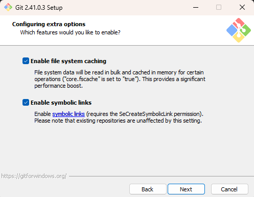
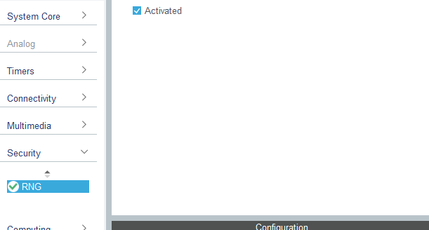
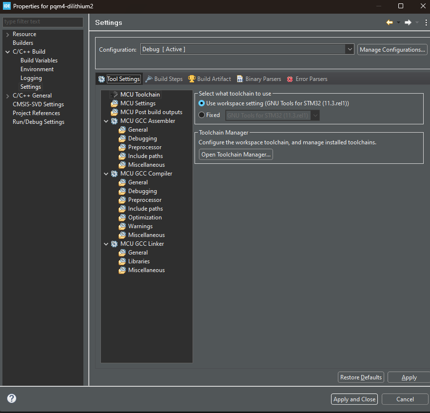
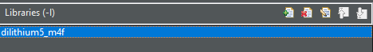
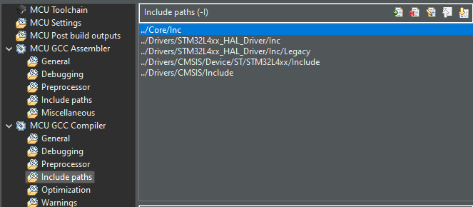

# Using the pqm4 Library in STM32CubeIDE

# Contents
- [Using the pqm4 Library in STM32CubeIDE](#using-the-pqm4-library-in-stm32cubeide)
- [Contents](#contents)
  - [Introduction](#introduction)
  - [Prerequisites](#prerequisites)
  - [Install Git](#install-git)
  - [Enable Developer Mode](#enable-developer-mode)
  - [Clone the pqm4 Library](#clone-the-pqm4-library)
  - [STM32CubeIDE Project](#stm32cubeide-project)
    - [Enable the hardware RNG](#enable-the-hardware-rng)
    - [Download the static libraries](#download-the-static-libraries)
    - [Add the static libraries to your project](#add-the-static-libraries-to-your-project)
    - [Include header files](#include-header-files)
    - [Using the STM32Cube hardware RNG](#using-the-stm32cube-hardware-rng)
    - [Using the library](#using-the-library)

## Introduction

This guide demonstrates how to quickly and easily use the pqm4 implementations in the STM32CubeIDE. This library includes a number of highly optimized implementations of post-quantum cryptographic algorithms to run on an ARM Cortex-M4 microcontroller.

## Prerequisites

To follow this guide, you will need a to have the STM32CubeIDE installed and have a basic knowledge of how to use it. If you do not have this installed please refer to this [guide](https://github.com/QUB-ARM-STM32/User-Guide/blob/master/STM32CubeIDE/README.md). It is also recommended that you have a basic knowledge of [git](https://git-scm.com/).

I have produced this guide for Windows, however it should be similar for Linux and MacOS.

## Install Git

To clone the repository correctly we will need to download and install [git for windows](https://gitforwindows.org/).

When installing you must ensure to enable symbolic links on windows. This is required as the pqm4 library uses symbolic links within its codebase.



## Enable Developer Mode

To ensure the symbolic links are correctly converted to windows shortcuts you must enable developer mode on your machine. To do this follow the steps below:

- Windows 10
    - `Settings` -> `Update & Security` -> `For developers` -> `Developer Mode`

- Windows 11
    - `Settings` -> `Privacy & Security` -> `For developers` -> `Developer Mode`

## Clone the pqm4 Library

To clone the pqm4 library correctly run the following command from `Git Bash`:

```bash
git clone --recursive -c core.symlinks=true https://github.com/mupq/pqm4.git
```

This will clone the pqm4 library and ensure that the symbolic links are converted to windows shortcuts.

## STM32CubeIDE Project

To get started create a new STM32CubeIDE project and enable all the peripherals with their default values.

### Enable the hardware RNG

To use the hardware RNG we must enable it by opening your `.ioc` file.



### Download the static libraries

To use the schemes included in the pqm4 library in our own code you must download the static libraries I have compiled from the [release page](https://github.com/QUB-ARM-STM32/pqm4/releases) of this repository. In this release you will find the static libraries and an implementation of `randombytes.c` that uses the hardware RNG provided by the STM32Cube libraries.

**At the time of writing the only schemes available are kyber and dilithium**

### Add the static libraries to your project

To add the static libraries to your project simply go to `Project` -> `Properties` -> `C/C++ Build` -> `Settings` -> `Tool Settings`.



Then go to `MCU GCC Linker` -> `Libraries` and add the library you want use to the `Libraries(-l)` section. Do not add the `lib` prefix or the `.a` extension.

**N.B As pqm4 uses the same method names in its schemes you can only include one library per project**



Next we need to add the correct path to where the libraries are stored. To do this add the path to the `Library search path(-L)` section.

### Include header files

To include the header files from the pqm4 library open the the project C/C++ build settings and go to `MCU GCC Compiler` -> `Include Paths`.



You will need to add the paths to the following directories in the pqm4 library:

- `common/`
- `mupq/common``
- The directory of the scheme you want to use, for example `kyber512_m4fspeed` would be `crypto_kem/kyber512/m4fspeed/`

### Using the STM32Cube hardware RNG

Provided you have enabled the hardware RNG earlier, you can now use the `randombytes.c` file provided in the release folder. To add it to your project simply copy it into your projects `Src` folder.

To enable the script to use the STM32Cube hardware RNG and not a non-random implementation you must add `STM32CUBE` as a define in the compiler settings.

To do this open the properties window and open the C/C++ build settings. Go to `MCU GCC Compiler` -> `Preprocessor` and add `STM32CUBE` to the `Defined symbols(-D)` section.

### Using the library

Now to use the library you have selected simply include the header file at the beginning of your code:

```c
#include "api.h"
```

Using the library functions can be tricky so I recommend simply looking at the source code included in `api.h` to see how to use the functions.